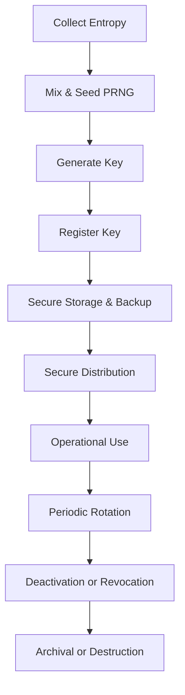

---

# 🔐 **Understanding Cryptographic Key Lifecycle and Entropy**

A secure cryptographic system depends on generating and managing keys in a way that ensures unpredictability, protection, and compliance. This guide walks through the key lifecycle stages—from randomness collection to key destruction—while explaining the role of entropy and the importance of secure handling at every step.

---

## 🔁 Cryptographic Key Lifecycle Phases

| Phase                  | Description                                     |
| ---------------------- | ----------------------------------------------- |
| **1. Initialization**  | Collect entropy and generate cryptographic keys |
| **2. Active Use**      | Operate, store, rotate, and securely share keys |
| **3. Decommissioning** | Revoke, deactivate, or archive keys after use   |
| **4. Termination**     | Permanently erase all copies of retired keys    |

---

## 🔧 **1. Initialization Phase – Key Generation & Registration**

### 🔑 1.1 What Is Entropy and Why It Matters

**Entropy** refers to the level of unpredictability in a data source. High-entropy values are critical when creating secure cryptographic keys, ensuring they can't be guessed or reproduced.

---

### 📥 1.2 Sources of Entropy

To produce high-quality random values, entropy must be gathered from reliable and diverse sources:

#### ✅ Operating System Sources

| System         | Methods                                      |
| -------------- | -------------------------------------------- |
| **Linux/Unix** | `/dev/random`, `/dev/urandom`, `getrandom()` |
| **Windows**    | `CryptGenRandom()`, `BCryptGenRandom()`      |

These OS-level APIs collect randomness from system activities like hardware interrupts, timing variations, and user input.

---

#### ✅ Hardware and Dedicated Sources

* **CPU Instructions**: Intel `RDRAND`, AMD `RDSEED`
* **Trusted Platform Module (TPM)**: TPM 2.0 `GetRandom` function
* **External Devices**: USB TRNGs, PCIe hardware, quantum RNGs
* **Embedded Noise Sources**: Clock jitter, temperature fluctuation, etc.

---

### 🔁 1.3 Cleaning & Combining Entropy

Raw entropy from physical or software sources may be biased or partially predictable. To correct this:

* Apply cryptographic hash functions (e.g., **SHA-256**, **SHA-3**)
* Or use block cipher methods (e.g., CBC-MAC)

**Example process:**

```
Seed = SHA-512(Entropy_from_TPM || Hardware_RNG || OS_Random)
```

Combining multiple entropy sources improves randomness quality and resilience.

---

### 📊 1.4 Testing Entropy Quality

Follow these practices to ensure entropy is sufficient and not compromised:

* Use built-in OS mechanisms for entropy health monitoring
* For hardware RNGs, apply **NIST SP 800-90B** statistical tests:

  * **Repetition Test**
  * **Adaptive Proportion Test**

---

### 🔄 1.5 Re-Seeding (Entropy Refresh)

Over time, PRNGs should be re-seeded with fresh entropy to reduce the risk of key prediction if internal state leaks. Periodic reseeding ensures forward security.

---

### 🔁 1.6 PRNGs: Pseudorandom Number Generators

PRNGs generate long sequences of random-looking values from a single high-entropy seed. They're commonly used for:

* Key generation
* Initialization vectors (IVs)
* Nonces

#### 🔍 Why Use PRNGs?

* TRNGs are slow or not always available
* PRNGs are efficient and scalable
* Good PRNGs (e.g., DRBGs) retain randomness when seeded properly

---

### 🎲 1.7 TRNGs: True Random Number Generators

TRNGs collect randomness from **physical phenomena** such as:

* Thermal or atmospheric noise
* Radioactive decay
* Quantum uncertainty

They offer **true unpredictability**, making them ideal for initial seed generation.

---

## 🔒 Key Generation Best Practices

| Aspect             | Guideline                                                      | Purpose                              |
| ------------------ | -------------------------------------------------------------- | ------------------------------------ |
| Entropy Validation | Confirm input randomness with NIST tests or trusted hardware   | Prevent weak keys                    |
| Key Size           | Follow best practices: AES (256-bit), RSA (2048+ bits)         | Balance between speed and strength   |
| Derivation         | Use KDFs (HKDF, PBKDF2) to derive session keys                 | Avoid reusing sensitive material     |
| Algorithms         | Stick to vetted standards (FIPS-approved, AES, ECC, RSA)       | Ensure algorithmic safety            |
| Key Uniqueness     | Track and prevent key collisions                               | Reduce exposure risks                |
| Secure Generation  | Use hardware like TPMs or HSMs                                 | Protect keys at origin               |
| Audit Trail        | Log generation details (user, time, key type)                  | Enable compliance and accountability |
| Metadata           | Tag keys with version, usage, algorithm, and policy references | Aid lifecycle and policy enforcement |

---

## 📝 1.8 Key Registration

After generation, keys must be registered and controlled:

* Assign a unique Key ID
* Document creation time, type, and owner
* Bind lifecycle policies (expiration, rotation)
* Store in secure inventory (KMS, TPM, or HSM)

---

## 🧪 2. OPERATIONAL PHASE – Usage & Maintenance

### 🔐 2.1 Key Storage and Protection

| Method               | Description                                          |
| -------------------- | ---------------------------------------------------- |
| **HSM**              | Tamper-resistant hardware; keys remain secure inside |
| **TPM**              | Secure chip embedded in hardware platforms           |
| **Encrypted Vaults** | Software-protected storage using KEKs                |

#### 🗂 Backup Guidelines

* Store copies in different geographic or logical zones
* Encrypt backups using separate KEKs
* Apply access control and audit logging
* Perform integrity checks and alerts for tampering

---

### 📦 2.2 Secure Key Distribution

| Step                       | Best Practice                                      |
| -------------------------- | -------------------------------------------------- |
| **Manual Transfer**        | Encrypt with KEK or split into secret shares       |
| **Automated Provisioning** | Use PKI/KMS to install keys on devices             |
| **Key Wrapping**           | Wrap keys (e.g., AES Key Wrap) during transmission |
| **Transport Layer**        | Enforce TLS 1.3, SSH, or IPsec                     |
| **Certificate Pinning**    | Avoid spoofed certs or rogue CAs                   |
| **Zero Trust**             | Always authenticate; apply least-privilege access  |

---

### 🔐 2.3 Key Usage Guidelines

* Keys should only be used for intended purposes (e.g., signing, encrypting)
* Access restricted by roles and policies
* Log every access or operation
* Secure processing against side-channel attacks (constant-time ops)
* Use TPM sealing to restrict key use to verified hardware

---

### 🔁 2.4 Key Rotation

To limit exposure from long-term key use:

* Define cryptoperiods (valid durations)
* Rotate keys before expiration
* Ensure forward secrecy (new keys can't decrypt old data)
* Maintain dual-key support during rotation
* Automate expiry alerts and rotate via KMS if possible

---

## 🛑 3. POST-USE PHASE – Revocation & Archival

### ⏸ 3.1 Key Deactivation

* Mark keys inactive after use
* Enable grace periods for transitions
* Document affected systems or dependencies

---

### ❌ 3.2 Key Revocation

In case of compromise or incident:

* Immediately mark key as revoked
* Use CRLs or OCSP to inform systems
* Link revocation to incident response plans

---

### 🗃 3.3 Key Archiving

* Encrypt and store unused keys in secure, offline storage
* Apply retention rules (legal or business-driven)
* Require multiple approvals (quorum) for access
* Restrict reactivation to critical recovery scenarios

---

## 🔥 4. TERMINATION PHASE – Destruction

### 🧹 4.1 Key Destruction

* Securely erase all key copies from memory, storage, and backups
* Use cryptographic wiping (zeroization)
* Require dual authorization and create destruction logs
* Follow standards like **NIST SP 800-88** or **ISO/IEC 27040**

---

### ⚖️ 4.2 Compliance Considerations

* Comply with GDPR, HIPAA, PCI DSS, or other frameworks
* Log destruction events for audit trails
* Be aware of cross-border data deletion laws

---

## 🧩 Quorum-Based Approval (M-of-N Control)

Use **multi-party authorization** for high-impact actions:

* Key export/import
* Archival access
* Destruction or recovery

This prevents any one administrator from acting alone to compromise key material.

---

## 🔁 Secure Key Workflow Summary



---

## 📘 Glossary

| Term        | Description                                                   |
| ----------- | ------------------------------------------------------------- |
| **Entropy** | Randomness used to generate secure keys                       |
| **PRNG**    | Pseudorandom generator using a seed for random-looking output |
| **TRNG**    | Hardware generator using physical sources of randomness       |
| **KDF**     | Key derivation from a base key (e.g.,                         |


PBKDF2, HKDF) |
\| **HSM** | Hardware device for secure key management |
\| **TPM** | Secure module embedded in devices for storing secrets |
\| **KEK** | Key that encrypts other keys |
\| **CRL** | List of revoked certificates |
\| **OCSP** | Protocol for real-time certificate status checking |
\| **Quorum Access** | Requires multiple approvals for key operations |
\| **Forward Secrecy** | Ensures past data stays safe even if current keys are breached |

---

